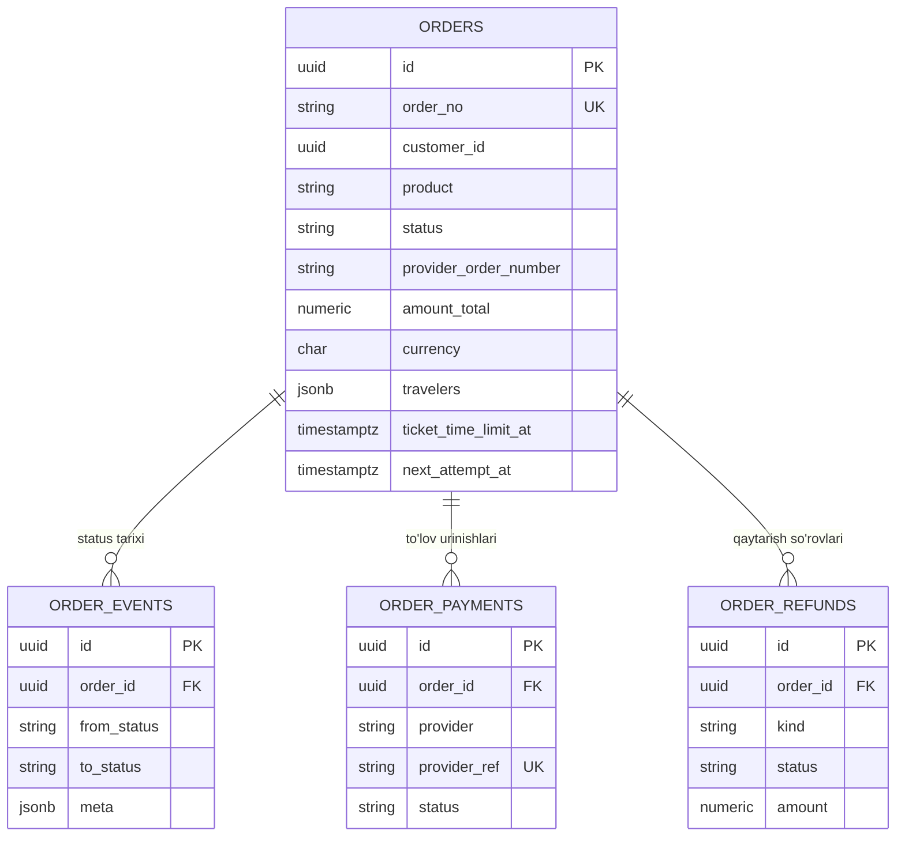
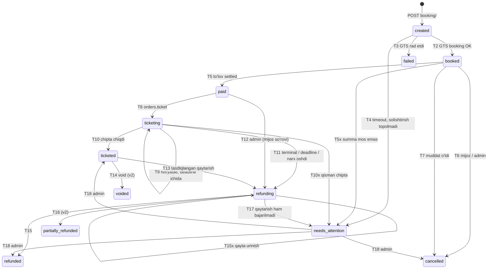
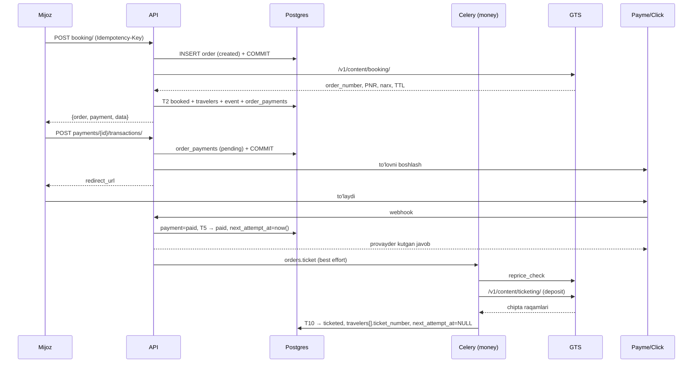
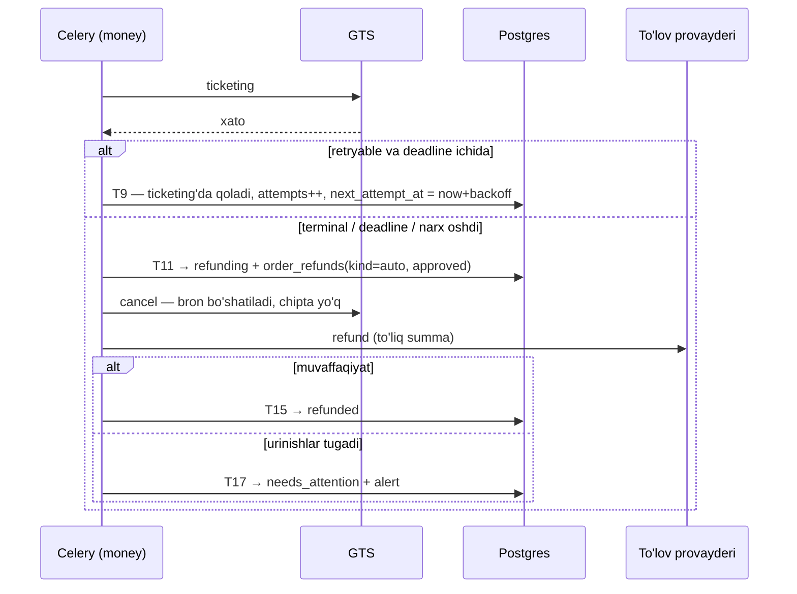

# 3. Dizayn — buyurtma tizimi

**Bu hujjat order tizimi bo'yicha avtoritet.** Buyurtma, to'lov, chipta, bekor
qilish va qaytarishga tegishli har qanday ziddiyatda u ustun turadi
([`00-README.md`](00-README.md)).

Asos: [`01-research.md`](01-research.md) xulosalari (X1…X10) va
[`02-current-audit.md`](02-current-audit.md) topilmalari (A1…A11).

---

## 3.0 Qamrov

**Kiradi (v1):** bron → to'lov → chipta chiqarish → yakun; bron bekor qilish;
chiptadan keyin to'liq qaytarish (quote + admin tasdig'i); avtomatik
kompensatsiya; bron muddatining supurilishi; holat sinxronizatsiyasi;
buyurtma ro'yxati, tafsiloti, tarixi va kvitansiyasi; admin yuzasi.

**Kirmaydi (v2):** `void` (chiqarilgan chiptani kunning o'zida bekor qilish),
**qisman** qaytarish (yo'nalish bo'yicha), reissue/o'zgartirish, qo'shimcha
xizmatlar (o'rindiq, bagaj) sotib olish, bo'lib to'lash.

v2 qismlari **modelda joy egallaydi** (`voided` va `partially_refunded`
statuslari, `refunds.scope` maydoni), lekin yo'li qurilmaydi — sinxronizatsiya
GTS'dan `VO`/`PRF` olib kelsa, holat to'g'ri yoziladi.

---

## 3.1 Qarorlar reyestri

| # | Qaror | Muqobil va nega rad etildi |
|---|---|---|
| **O1** | **Order — yagona aggregate root.** Holat mashinasi ham, saga ham `orders` modulida. `app/modules/booking/` placeholderi **o'chiriladi** | Muqobil: `ARCHITECTURE.md` §5 dagidek saga `booking/` da. Rad etildi: holat mashinasi va uni haydaydigan saga birga o'zgaradi; ajratilsa `booking` har qadamda `orders_service.transition()` ni chaqiradi va `orders` belgilagan navbatni o'qiydi — modullararo sikl. Bu `ARCHITECTURE.md` §5 dan **qayd etilgan chetlanish** |
| **O2** | **To'lov: charge → ticketing → xato bo'lsa refund.** Hold/capture emas | Muqobil: hold (authorize) → ticket → capture. Toza pul oqimi, lekin `PROJECT.md` D7 Payme/Click'ni **redirect + webhook** deb belgilagan va redirect checkout'da hold biz boshqaradigan narsa emas. Mijozga ticketing paytida **"chipta chiqmasa pul qaytariladi"** deb ko'rsatiladi (X4) |
| **O3** | `POST /public/{product}/booking/` **qoladi** (ichi qayta yoziladi). `POST /public/{product}/cancel/` **olib tashlanadi** → `POST /public/orders/{id}/cancel/` | Bekor qilish — buyurtma resursining amali, mahsulot oqimining qadami emas (`API.md` §16). `STATUS.md` №78 uni oqim qadamiga qo'ygan edi, chunki lokal buyurtma qatori yo'q edi; endi bor |
| **O4** | Adapter porti `OrderOperations` — **normallashtirilgan** natijalar qaytaradi | Muqobil: bugungidek GTS `dict` ini uzatish. Rad etildi: saga GTS shakllariga bog'lanib qolsa, ikkinchi vertikal butun sagani qayta yozdiradi (`PHASES.md` 3-faza qabul mezoni) |
| **O5** | Ticketing xatolari **sinflanadi**: `retryable` / `terminal` / `deadline` | Muqobil: har qanday xatoda refund. Rad etildi: GTS deposit balansimiz bo'shashi — *bizning* operatsion nosozligimiz, va u kundagi barcha buyurtmalarni keraksiz qaytarardi (`01-research.md` §1.6 №10) |
| **O6** | Ticketingdan **oldin** qayta narxlash (`reprice_check`) | Muqobil: to'g'ridan-to'g'ri ticketing. Rad etildi: to'lov bilan chipta orasida tarif o'zgarsa, farqni kim to'lashi noaniq qoladi |
| **O7** | `orders.currency` **har doim** `payments.currency` ga teng | Muqobil: buyurtma GTS valyutasida, to'lov UZS'da, oradagi konvertatsiya bizda. Rad etildi: `ARCHITECTURE.md` A3 konvertatsiyani GTS tomonga qo'ygan; ikkinchi kurs manbasi ikkinchi haqiqat degani |
| **O8** | Idempotentlik **uch qavatda**; haqiqiy qo'riqchi — bazadagi `UNIQUE`. Birinchi qavatning kalitini **klient bermasa server so'rovdan hosil qiladi** (2026-08-18) | Muqobil: faqat Redis — rad etildi, Redis'dagi yozuv kesh: `FLUSHALL` yoki evict ikkinchi **haqiqiy** bron degani (X6). Kalitni majburiy qilish ham rad etildi: u himoyani klientning holat boshqaruviga bog'lardi, va o'sha holat buzilishining narxi ikkinchi o'rin |
| **O9** | **Event sourcing yo'q** — append-only status tarixi; provayderning xom javobi o'sha hodisaning `meta` sida, alohida snapshot jadvalisiz | `01-research.md` §1.8 da asoslangan (X10) |
| **O10** | Yo'lovchilar `orders.travelers` JSONB da, **bizning shaklimizda** | Muqobil: `order_travelers` jadvali. Rad etildi: v1 da yo'lovchi bo'yicha qidiruv talabi yo'q, jadval esa faqat `JOIN` qo'shardi. A8 baribir yopiladi — shaklni biz yozamiz, demak anonimlashtirsa bo'ladi (GTS blobida bu imkonsiz edi) |
| **O11** | Qaytarish: **quote (o'qish) → so'rov → admin tasdig'i → bajarish**. Avtomatik kompensatsiya tasdiqsiz | Muqobil: to'liq avtomatik. Rad etildi: jarima summasi tarif qoidasidan keladi va xato qimmatga tushadi (`PROJECT.md` §16.3 hali ochiq) |
| **O12** | Bir buyurtmaga **bitta** summa; `order_payments` — urinishlar | Stripe naqshi (X2), lekin bitta jadvalda: summa va valyuta `orders` da, urinishlar `order_payments` da. Mijoz Payme'da rad etilib Click bilan to'lasa — ikkinchi urinish, ikkinchi buyurtma emas |
| **O13** | **Outbox jadvali yo'q** — `orders` jadvalining o'zi navbat: `next_attempt_at` + har 30 soniyalik poller | Muqobil: `ARCHITECTURE.md` §8 dagi transactional outbox. Rad etildi **hajm sababli**: kafolat bir xil (keyingi qadam holat o'zgarishi bilan bitta tranzaksiyada belgilanadi), narxi esa bitta jadval, bitta task va bitta tushuncha kam. Evaziga — 30 soniyagacha kechikish, u ham commitdan keyingi to'g'ridan-to'g'ri yuborish bilan qoplanadi (§3.7) |

---

## 3.2 Domain model



**To'rtta jadval, boshqa hech narsa.**

| Entity | Nima uchun alohida |
|---|---|
| `Order` | Yagona aggregate root: holat mashinasi, egalik, pul yig'indisi, yo'lovchilar va qayta urinish hisobi (X1) |
| `OrderEvent` | Har bir o'tishning append-only izi. Provayderning o'sha qadamdagi **xom javobi ham shu yerda**, `meta` ichida (O9) |
| `OrderPayment` | Bitta to'lov **urinishi**. `provider_ref` unique — takroriy webhook ikki marta yechmasligining poydevori (O12) |
| `OrderRefund` | Qaytarish so'rovi va uning tasdiq sikli. Avtomatik kompensatsiya ham, mijoz so'rovi ham shu yerga tushadi (O11) |

### Nima jadval **emas** va nega

Bu ro'yxat dizaynning yarmini tashkil qiladi — har bir "yo'q" ataylab:

| Tushuncha | Qayerda yashaydi | Nega alohida jadval emas |
|---|---|---|
| **Bron** (booking) | `orders` ustunlari: `provider_order_number`, `provider_pnr`, `provider_status`, `ticket_time_limit_at` | Buyurtmaga aynan bitta bron to'g'ri keladi — alohida jadval faqat `JOIN` qo'shardi |
| **Chipta** (ticket) | `orders.travelers[].ticket_number` | Chipta yo'lovchiga tegishli, yo'lovchilar esa allaqachon shu yerda |
| **Yo'lovchilar** | `orders.travelers` JSONB, **bizning shaklimizda** | Shaklni o'zimiz yozganimiz uchun anonimlashtirish ishlaydi — GTS blobida bu imkonsiz edi (A8) |
| **To'lov niyati** (payment intent) | `orders` ning o'zi: `amount_total`, `currency`, `payment_status` | Bir buyurtmaga bitta summa. Alohida "niyat" qatori `orders` da bor narsani takrorlardi |
| **Provayder javoblari** | `order_events.meta` | Tarix baribir kerak edi; xom javobni o'sha hodisaga biriktirish ikkinchi jadvalni ortiqcha qiladi |
| **Outbox** | `orders` jadvalining o'zi — `next_attempt_at` + poller | `O13` da asoslangan |

> **Bu 8 jadvalli dastlabki dizaynning qisqartirilgani (2026-08-18).** Sabab —
> hajm: bu o'rnatma yiliga o'n minglab emas, minglab buyurtma ko'radi, va
> transactional outbox bilan snapshot jurnali bu miqyosda o'zini oqlamaydi.
> Kafolatlar saqlanadi (§3.8), mexanizm soddalashadi.

---

## 3.3 Holat mashinasi

### Statuslar

| Status | Ma'no | Sinf | Mijozga ko'rinadigan matn |
|---|---|---|---|
| `created` | Qator yozildi, GTS chaqiruvi ketmoqda | aktiv | "Bron qilinmoqda" |
| `booked` | GTS o'rinni ushlab turibdi, to'lov kutilmoqda | kutish | "To'lov kutilmoqda" |
| `paid` | Pul yechildi, ticketing navbatda | kutish | "Chipta chiqarilmoqda" |
| `ticketing` | Ticketing GTS'da ketmoqda | aktiv | "Chipta chiqarilmoqda" |
| `ticketed` | Chipta chiqdi | yakuniy | "Chipta tayyor" |
| `refunding` | Qaytarish jarayonda | aktiv | "Pul qaytarilmoqda" |
| `refunded` | Pul to'liq qaytdi | yopiq | "Pul qaytarildi" |
| `partially_refunded` | Qisman qaytdi (v2 yo'li) | yakuniy | "Qisman qaytarildi" |
| `cancelled` | Bron bo'shatildi | yopiq | "Bekor qilindi" |
| `voided` | Chiqarilgan chipta bekor qilindi (v2) | yopiq | "Chipta bekor qilindi" |
| `failed` | Bron umuman ochilmadi — pul harakatlanmagan | yopiq | "Bron amalga oshmadi" |
| `needs_attention` | Pul harakatlandi, avtomatik kompensatsiya bajarilmadi | qo'lda | "Ko'rib chiqilmoqda" |

**Sinflar** (`01-research.md` §1.4):
*aktiv* — fon ishi bor · *kutish* — tashqi hodisa kutilmoqda ·
*yakuniy* — fon ishi yo'q, yangi amal boshlanishi mumkin ·
*yopiq* — chiqish yo'q · *qo'lda* — faqat staff chiqara oladi.

`paid` va `ticketing` mijozga **bir xil** matn ko'rsatadi. Ular baribir alohida:
`paid` — navbatda, `ticketing` — GTS'da ish ketmoqda, ya'ni retry hisoblagichi
va SLA boshqacha.

> **Mijozga ko'rinadigan matnlar kodda emas.** Ular DB sozlamasi
> (`PROJECT.md` §7), uch tilda, `settings` moduli orqali. Kodda faqat kalit.

### Diagramma



### O'tishlar jadvali

| # | Dan → Ga | Trigger | Guard | Keyingi qadam (o'sha tranzaksiyada belgilanadi) | Guard buzilsa |
|---|---|---|---|---|---|
| **T1** | ∅ → `created` | `POST /{product}/booking/` | `request_id` va `offer_id` bor; mijoz autentifikatsiyadan o'tgan (`Idempotency-Key` — ixtiyoriy, bo'lmasa so'rovdan hosil qilinadi) | — | `422` |
| **T2** | `created` → `booked` | GTS `booking` muvaffaqiyatli | `provider_order_number` **va** summa/valyuta o'qildi | `travelers` to'ldiriladi · `order_payments` qatori · `notify.order_booked` | O'qilmasa → `needs_attention`, xom javob hodisada |
| **T3** | `created` → `failed` | GTS `status: "error"` | — | — | — |
| **T4** | `created` → `needs_attention` | GTS timeout / erishib bo'lmadi, `orders.reconcile_orphans` 3 urinishda topolmadi | — | `alert.stuck` | — |
| **T5** | `booked` → `paid` | To'lov `paid` bo'ldi (webhook yoki `payments.reconcile`) | `payment.amount` == `order.amount_total` **va** valyutalar teng | `orders.ticket` · `notify.order_paid` | Summa mos emas → `needs_attention` |
| **T5x** | `booked` → `needs_attention` | To'lov settled bo'ldi, lekin summa boshqa | — | — | Pul harakatlangan, xavfsiz turadigan joy yo'q |
| **T6** | `booked` → `cancelled` | `POST /orders/{id}/cancel/` (mijoz) yoki admin | To'lov `paid` emas | `gts.cancel` · `notify.order_cancelled` | To'langan bo'lsa → `409`, qaytarish yo'li taklif qilinadi |
| **T7** | `booked` → `cancelled` | `orders.expire_unpaid` beat | `now > ticket_time_limit_at − ticket_margin` va to'lov yo'q | `gts.cancel` · `notify.order_expired` | — |
| **T8** | `paid` → `ticketing` | `orders.ticket` task boshlandi | Status `paid` (aks holda task jimgina chiqadi — idempotentlik) | — | — |
| **T9** | `ticketing` → `ticketing` | `retryable` xato | `attempts < max` **va** `now < ticket_deadline` | `orders.ticket` (backoff bilan) | — |
| **T10** | `ticketing` → `ticketed` | GTS `ticketing` muvaffaqiyatli | **Har bir** yo'lovchida chipta raqami bor | `notify.order_ticketed` | Qisman chiqsa → `needs_attention` |
| **T10x** | `ticketing` → `needs_attention` | Yo'lovchilarning bir qismida chipta bor, bir qismida yo'q | — | — | Avtomatik hech narsa buni tuzata olmaydi |
| **T11** | `ticketing` → `refunding` | `terminal` xato · `deadline` o'tdi · narx tolerantlikdan oshdi | To'lov `paid` | `refunds` qatori (`kind=auto`, `approved`) · `refunds.commit` | — |
| **T12** | `paid` → `refunding` | Admin (mijoz so'rovi bo'yicha) | Ticketing hali boshlanmagan | `refunds` qatori · `refunds.commit` | — |
| **T13** | `ticketed` → `refunding` | Admin tasdiqladi | `refund.status == approved` | `refunds.commit` | — |
| **T14** | `ticketed` → `voided` | v2 — void oynasi ichida | `now < void_deadline_at` | — | — |
| **T15x** | `refunding` → `refunding` | Qaytarish urinishi yiqildi | `attempts < 8` | `refunds.commit` (backoff bilan) | — |
| **T15** | `refunding` → `refunded` | Provayder qaytardi (+ GTS tomoni bajarildi) | Qaytarilgan summa == to'langan summa | `notify.order_refunded` | Kam bo'lsa → T16 |
| **T16** | `refunding` → `partially_refunded` | v2 / sinxronizatsiya `PRF` keltirdi | — | — | — |
| **T17** | `refunding` → `needs_attention` | Urinishlar tugadi | — | `alert.stuck` | — |
| **T18** | `needs_attention` → `ticketed` \| `refunded` \| `cancelled` | Admin qo'lda hal qildi | `CurrentStaff`; sabab majburiy | audit yozuvi | — |

Jadvalda **yo'q** bo'lgan har qanday o'tish — `409 conflict`.

`ticket_deadline` = `ticket_time_limit_at − ticket_margin`
(`ticket_margin` — DB sozlamasi, sukut bo'yicha 30 daqiqa).
`ticket_time_limit_at` noma'lum bo'lsa — `paid_at + fallback` (sukut 3 soat).

### O'tish mexanikasi

```python
await orders_service.transition(
    session,
    order_id,
    to=OrderStatus.PAID,
    actor=Actor.system("payments.webhook"),
    reason="payme_perform",
)
```

Ichida, **bitta tranzaksiyada**:

1. `SELECT … FOR UPDATE` — qator qulflanadi (A9 ni yopadi);
2. joriy status + `to` juftligi jadvalda bormi — yo'q bo'lsa `Conflict`;
3. guard tekshiriladi;
4. `orders` yangilanadi (status + tegishli `*_at` vaqt tamg'asi);
5. `order_events` ga qator qo'shiladi;
6. keyingi qadam kerak bo'lsa `next_attempt_at` qo'yiladi;
7. `COMMIT`.

Task yuborish **hech qachon** shu tranzaksiya ichida bo'lmaydi: commitdan keyin
bevosita yuboriladi, va yuborilmay qolsa poller uni `next_attempt_at` bo'yicha
baribir topadi (§3.7, X5).

### Ticketing xatolari tasnifi (O5)

| Sinf | Belgilari | Xatti-harakat |
|---|---|---|
| `retryable` | Timeout, tarmoq, GTS 5xx, `not enough credits on account`, GTS band/qulflangan | Backoff bilan qayta urinish, `ticket_deadline` gacha. Deposit xatosi **alohida hisoblagich va alert** — bu balansni to'ldirish signali, mijozning muammosi emas |
| `terminal` | Tarif yo'qoldi, reys bekor qilindi, provayder rad etdi, bron topilmadi, narx tolerantlikdan oshdi | Darhol `refunding` |
| `deadline` | `retryable`, lekin `ticket_deadline` o'tdi | `refunding` |

Sinf **adapterda** aniqlanadi (`OrderOperations.classify`), chunki xato
matnlari vertikalga xos. Tanimagan xato — **`terminal`**: mijozga pulini
qaytarish, noma'lum sababda cheksiz kutishdan yaxshiroq.

### Backoff

`orders.ticket` urinishlari: 30s → 2daq → 5daq → 15daq → 30daq → keyin har
30 daqiqada, `ticket_deadline` gacha. Har bir kechikishga ±20% jitter.
Maksimal urinish soni yo'q — chegara **vaqt**, chunki bron muddati tabiiy
to'siq (X3).

---

## 3.4 Ma'lumotlar bazasi

**To'rtta jadval.** Konvensiyalar `ARCHITECTURE.md` §10 dan: UUID PK (ilova tomonda),
`created_at`/`updated_at`/`deleted_at`, pul — `NUMERIC(18,2)` + alohida `CHAR(3)`,
nomlash konvensiyasi `db/base.py` dan.

> **CHECK cheklovlari qo'lda yoziladi.** Alembic autogenerate ularni o'tkazib
> yuboradi — har bir migratsiyada `CheckConstraint` qo'lda qo'shiladi va
> `downgrade()` da o'chiriladi.

### `orders`

| Ustun | Tur | Izoh |
|---|---|---|
| `id` | UUID PK | Ilova tomonda `uuid4` — id insertdan oldin ma'lum bo'lishi kerak (`db/mixins.py:30-32`) |
| `order_no` | `String(24)` UK | Inson o'qiydigan raqam: `B2C-2608-000123`, Postgres sequence'dan. Kerak, chunki `created`/`failed` buyurtmada GTS raqami **yo'q**, support va kvitansiya esa bir tutqichni talab qiladi |
| `customer_id` | UUID, indeks | **FK yo'q** — boshqa modul (`ARCHITECTURE.md` §4). Hech qachon `NULL` (`PROJECT.md` D4) |
| `product` | `String(16)` | CHECK: `ProductCode` qiymatlari |
| `status` | `String(24)` | **CHECK bor** — endi bu bizning lug'atimiz (A3 ni yopadi) |
| `provider` | `String(16)` | `gts`. Kelajakda to'g'ridan-to'g'ri integratsiya bo'lsa joy tayyor |
| `provider_order_number` | `String(64)` | GTS `order_number` — `cancel`, `retrieve`, `ticketing` shuni oladi |
| `provider_order_uid` | `String(64)` | GTS `order_uid` — support so'raydi |
| `provider_pnr` | `String(32)` | `gds_pnr`. Admin qidiruvi shu bo'yicha (`API.md` §31) |
| `provider_status` | `String(16)` | GTS kodi **kelganicha** (`BO`/`TI`/…) — diagnostika uchun yo'qolmaydi |
| `request_id`, `offer_id` | `String(64)` | Kelib chiqqan qidiruv va taklif. Kesh emas — taklifning o'zi hech qayerda saqlanmaydi (D2) |
| `currency` | `CHAR(3)` | `booked` dan boshlab majburiy |
| `amount_total` | `NUMERIC(18,2)` | GTS tasdiqlagan jami. `created` da hali noma'lum |
| `amount_paid`, `amount_refunded` | `NUMERIC(18,2)` | Sukut `0` |
| `travelers` | `JSONB` | **Bizning shaklimizda**, GTS'niki emas — quyida |
| `provider_response` | `JSONB` | Provayderning **oxirgi** javobi. Tarixi `order_events.meta` da |
| `ticket_time_limit_at` | `timestamptz` | Bron muddati. `ticket_deadline` shundan hisoblanadi |
| `travel_start_at` | `timestamptz` | Mahsulotdan qat'i nazar: reys/kirish/tur sanasi |
| `route_summary` | `String(128)` | `TAS-IST-TAS`. Ro'yxatni blob ochmasdan ko'rsatish uchun |
| `idempotency_key` | `String(255)` | **Haqiqiy dublikat qo'riqchisi** (O8) |
| `attempts` | `SmallInteger` | Joriy qadamning urinishlari |
| `next_attempt_at` | `timestamptz` | **Poller shuni oladi** (O13). `NULL` — hozircha ish yo'q |
| `cancellation_reason` | `String(32)` | `customer` · `admin` · `timelimit` · `payment_failed` |
| `failure_message` | `Text` | Provayder rad etgan sabab |
| `attention_reason` | `String(64)` | Nega qo'lda hal qilish kerak |
| `booked_at`, `paid_at`, `ticketed_at`, `cancelled_at` | `timestamptz` | Hisobotlar `order_events` ni skanerlamasin |

**Cheklovlar:**

```sql
CHECK (product IN ('flight','railway','insurance','esim','transfer'))
CHECK (status IN ('created','booked','paid','ticketing','ticketed','refunding',
                  'refunded','partially_refunded','cancelled','voided','failed',
                  'needs_attention'))
-- Pul 'created' dan keyin majburiy:
CHECK (status = 'created' OR (amount_total IS NOT NULL AND currency IS NOT NULL))
CHECK (amount_paid >= 0 AND amount_refunded >= 0 AND amount_refunded <= amount_paid)
```

**Indekslar:**

```
ix_orders_customer_created      (customer_id, created_at DESC)
ix_orders_status                (status)
ix_orders_product               (product)
ix_orders_provider_pnr          (provider_pnr)
uq_orders_provider_number_live  (provider, provider_order_number) UNIQUE
                                WHERE provider_order_number IS NOT NULL AND deleted_at IS NULL
uq_orders_idempotency_key       (idempotency_key) UNIQUE WHERE idempotency_key IS NOT NULL
ix_orders_ticket_deadline       (ticket_time_limit_at) WHERE status = 'booked'
ix_orders_due                   (next_attempt_at)      WHERE next_attempt_at IS NOT NULL
```

Oxirgi ikkitasi **qisman indeks**: supurgich ham, poller ham jadvalning kichik qismini
skanerlaydi va u o'sganda ham arzon qoladi. `ix_orders_due` — O13 ning butun narxi.

**`deleted_at` yozilmaydi.** Buyurtma — moliyaviy hujjat (`PROJECT.md` §13), u
o'chirilmaydi, **anonimlashtiriladi**. Ustun `Entity` dan meros qoladi va har o'qishda
hisobga olinadi, lekin uni hech bir kod yozmaydi.

### `orders.travelers` — bizning shaklimiz

```json
[ { "position": 1, "type": "ADT",
    "first_name": "AZIMJON", "last_name": "YUSUFOV", "middle_name": null,
    "birth_date": "2002-12-20", "gender": "M", "citizenship": "UZ",
    "document": { "type": "PSP", "number": "FA2145157",
                  "issue_date": "2019-05-30", "expire_date": "2029-05-29" },
    "email": "…", "phone": "…",
    "provider_traveler_id": "4faa37bc-…",
    "ticket_number": "7653081297644",
    "anonymized_at": null } ]
```

> **Nega blob emas, lekin jadval ham emas.** GTS javobining ichidagi
> `data.passengers[]` — **bizga noma'lum shakl**: uni anonimlashtirib bo'lmaydi va
> A8 aynan shundan kelib chiqqan. Bu massiv esa adapter tomonidan **biz belgilagan
> shaklga** o'girilgan; ichida nima borligini bilamiz, demak akkaunt o'chirilganda
> ism, hujjat va kontaktni tozalab, chipta raqami bilan yo'lovchi turini qoldirish
> mumkin. Alohida jadval buni yaxshiroq qilmaydi — faqat `JOIN` va migratsiya
> qo'shadi (v1 da yo'lovchi bo'yicha qidiruv talabi yo'q).

### `order_events` — append-only

`Entity` **emas** — `audit_log` kabi `Base + UUIDPrimaryKeyMixin`: `updated_at` ham,
`deleted_at` ham ma'nosiz.

| Ustun | Izoh |
|---|---|
| `order_id` | FK (`ON DELETE CASCADE`) — **bir modul ichida**, ruxsat etilgan |
| `created_at` | |
| `from_status`, `to_status` | `from_status` birinchi hodisada `NULL` |
| `action` | `booking.confirmed`, `payment.settled`, `ticketing.failed` … |
| `actor_type`, `actor_id`, `actor_label` | `system` / `customer` / `staff` |
| `reason` | Qisqa matn |
| `meta` | JSONB — **o'sha qadamdagi xom provayder javobi shu yerda** |

Indeks: `(order_id, created_at)`.

`meta` alohida `order_snapshots` jadvalining o'rnini bosadi: tarix baribir kerak edi,
xom javobni o'sha hodisaga biriktirish esa ikkinchi jadvalni ortiqcha qiladi (O9).

### `order_payments` — to'lov urinishlari

| Ustun | Izoh |
|---|---|
| `order_id` | FK |
| `provider` | `payme` / `click` |
| `provider_ref` | Payme cheki `_id` / Click `payment_id`. **`(provider, provider_ref)` UNIQUE** (`provider_ref IS NOT NULL` bo'lganda) |
| `status` | `pending` · `paid` · `failed` · `cancelled` |
| `amount`, `currency` | |
| `redirect_url` | `flow: redirect` uchun |
| `paid_at`, `error_code`, `error_message`, `provider_state` JSONB | |

**Takroriy webhook ikki marta yechmasligining poydevori — o'sha unique indeks**, mantiq
emas (X6). Qator **tarmoq chaqiruvidan oldin** commit qilinadi: jarayon o'rtada o'lsa,
`provider_ref` siz qolgan qator solishtirish uchun dalil bo'ladi.

`payments` va `payment_transactions` ikkiga bo'linmadi: bir buyurtmaga bitta summa va
bitta valyuta, ular allaqachon `orders` da. Alohida "niyat" qatori hech nima qo'shmasdi
(O12).

### `order_refunds` — qaytarish so'rovlari

| Ustun | Izoh |
|---|---|
| `order_id` | FK |
| `payment_id` | Qaysi to'lovdan qaytariladi |
| `kind` | `auto` (ticketing yiqildi) · `customer` · `admin` |
| `status` | `requested` · `approved` · `rejected` · `processing` · `succeeded` · `failed` |
| `amount`, `penalty_amount`, `currency` | `auto` da jarima `0` |
| `requested_by`, `approved_by`, `reason` | |
| `provider_refund_ref` | To'lov provayderining qaytarish ma'lumotnomasi |
| `provider_order_action` | Upstream tomonda nima qilindi — bronni bo'shatish (`cancel`) yoki chiptani qaytarish (`refund`) |
| `failure_message` | Nega bajarilmagani |

Indekslar: `(order_id, created_at)` · `(status)` · **unique partial
`(order_id) WHERE status IN ('requested','approved','processing')`** — bitta
buyurtmada bir vaqtda bitta ochiq qaytarish. Ikkinchisi ochilsa u birinchisi
bilan bir xil pulga poyga qilardi.

> **O'z jadvali `next_attempt_at` i yo'q.** Navbatni buyurtma yuritadi va
> supurgich uni o'sha yerdan o'qiydi. Qaytarishsiz buyurtma bo'ladi, buyurtmasiz
> qaytarish esa yo'q — va qachon qayta urinish haqida bir-biriga zid javob
> beradigan ikkita ustun bittasi ortiqcha bo'lardi.

Alohida jadval, chunki tasdiq sikli o'ziga xos: admin panelda "tasdiq kutayotgan
qaytarishlar" ro'yxati kerak, va `orders` ga oltita ustun qo'shish keyinchalik qisman
qaytarish (bir buyurtmaga bir nechta qatorlar) kerak bo'lganda qayta ko'chirishga
majbur qilardi.

**Qayta urinish chegarasi — son, muddat emas.** Ticketingdan farqli, qaytarishda
tashqi deadline yo'q; 8 urinish (backoff bilan taxminan ikki soat) provayderning
uzilishiga yetadi va hech kim puliga bir kun kutmaydi. Undan keyin —
`needs_attention`.

---

## 3.5 Multi-product arxitektura

Bugun `flight`, ertaga `hotel`/`tour`. **Order mashinasi mahsulotni
bilmasligi kerak.** Buning uchun ikkita ajratish:

### 1. Nima ustunga chiqadi, nima blobda qoladi

| Ustunga chiqadi | Nega |
|---|---|
| Jami summa, valyuta | Har bir mahsulotda bor; to'lov shundan quriladi |
| Provayder identifikatorlari va statusi | Har bir keyingi chaqiruv shuni oladi |
| `ticket_time_limit_at` | Muddat supurgichi mahsulotni bilmaydi |
| `travel_start_at`/`travel_end_at` | Reys sanasi · mehmonxonaga kirish · tur boshlanishi — bitta ma'no |
| `route_summary` | Ro'yxatda ko'rsatiladigan qisqa satr |
| Yo'lovchi/mehmon + hujjat + chipta raqami | Har bir mahsulotda odam bor |

Qolgani — `routes`/`segments`, xona turi, tur dasturi — `orders.provider_response`
blobida. Ular faqat **ko'rsatish** uchun kerak, mantiq uchun emas.

### 2. `OrderOperations` porti

`ProductAdapter` (`app/providers/products/base.py`) qidiruv oqimi uchun
qoladi. Uning ustiga **ixtiyoriy** port qo'shiladi — vertikal buyurtma
amallarini qo'llab-quvvatlasa, shuni ham amalga oshiradi:

```python
class OrderOperations(Protocol):
    code: ProductCode

    # --- S2 da qurildi ---
    async def book(self, client, payload) -> BookingResult: ...
    async def cancel(self, client, payload) -> CancelResult: ...
    def status_map(self) -> Mapping[str, OrderStatus]: ...

    # --- S5 (ticketing) bilan keladi ---
    async def ticket(self, client, ref) -> TicketingResult: ...
    async def reprice(self, client, ref) -> RepriceResult: ...
    async def retrieve(self, client, ref) -> RetrieveResult: ...
    def classify(self, error: AppError) -> FailureClass: ...

    # --- S6 (qaytarish) va S7 (admin yuzasi) bilan ---
    async def refund_quote(self, client, ref) -> RefundQuote: ...
    async def refund_commit(self, client, ref) -> RefundCommitResult: ...
    def available_actions(self, order) -> tuple[OrderAction, ...]: ...
```

> **Port bo'lak-bo'lak o'sadi.** Protokolda faqat iste'molchisi bor metodlar
> turadi: `runtime_checkable` protokol metodning **mavjudligini** tekshiradi,
> ya'ni hali yozilmagan metodni e'lon qilish `isinstance` ni yiqitadi va hech
> nima bermaydi. Yuqoridagi bloklar — nima qachon qo'shilishining rejasi.

**Eng muhim o'zgarish shu:** bugun `book()` GTS `dict` ini qaytaradi
(A10), saga esa GTS shakllarini **ko'rmasligi kerak**. Natija dataclass'lari:

```python
@dataclass(frozen=True, slots=True)
class BookingResult:
    provider_order_number: str
    provider_order_uid: str | None
    provider_pnr: str | None
    provider_status: str  # GTS kodi, kelganicha
    status: OrderStatus  # kanonik
    total: Money
    ticket_time_limit_at: datetime | None
    void_deadline_at: datetime | None
    travelers: tuple[TravelerRef, ...]
    travel_start_at: datetime | None
    travel_end_at: datetime | None
    route_summary: str | None
    raw: dict[str, Any]  # order_events.meta uchun
```

Bu — `ARCHITECTURE.md` §7 talab qilgan, lekin order yo'lida mavjud bo'lmagan
anti-corruption qatlami.

**Natija:** `hotel` qo'shish = bitta adapter fayli + bitta registry yozuvi.
Saga, holat mashinasi, jadvallar, endpointlar, testlar o'zgarmaydi —
`PHASES.md` 3-faza qabul mezoni aynan shu.

### 3. Ikkita amaliy tuzoq

1. **`float` → `Decimal`.** GTS narxni JSON `float` sifatida beradi
   (`"price": 46.89`), `app/core/money.to_decimal` (`app/core/money.py:33`) esa `float` ni **rad etadi**
   (ataylab: `float` pul emas). Adapter `str()` orqali o'giradi:
   `to_decimal(str(raw_price))`.
2. **`ticket_time_limit` uch xil ko'rinishda kuzatilgan** — ISO datetime
   (kolleksiya), `4319` (yozib olingan javob), `288000` (`API.md` §20).
   Adapter uchalasini ham o'qiydi: `str` bo'lsa ISO; son bo'lsa — qiymat
   `10_000` dan kichik bo'lsa **daqiqa**, aks holda **soniya** (ikkalasi ham
   `created_at` ga qo'shiladi). Aniqlanmasa — `None`, ya'ni chaqiruvchi
   sozlamadagi zaxira oynani ishlatadi; taxmin qilinmaydi.
   **Bu chegaralash taxmin; jonli GTS'da tekshirilishi shart** (§3.10, Q1).
3. **Uchish vaqti mahalliy.** `departure_date` + `departure_time` aeroport
   vaqti, yonidagi `departure_timezone` esa ko'pincha bo'sh. Adapter `UTC±H`
   shaklini o'qiydi, aks holda UTC deb oladi. `travel_start_at` ustuni
   **tartiblash va eslatma** uchun; aniq mahalliy vaqt `provider_response` da
   qoladi.

---

## 3.6 API kontrakt

Umumiy qoidalar `API.md` §1–§16 dan o'zgarmaydi: envelope, xato katalogi,
yo'l oxiridagi slash, `snake_case`, pul — satr.

### Public

| Metod | Yo'l | Idem. | Izoh |
|---|---|---|---|
| `POST` | `/public/{product}/booking/` | ✔ | Buyurtma va to'lovni yaratadi |
| `GET` | `/public/orders/` | — | `?product=`, `?status=`, `?payment_status=`, `?search=`, `?created_from/to=` |
| `GET` | `/public/orders/{id}/` | — | To'liq tafsilot |
| `GET` | `/public/orders/{id}/history/` | — | Status tarixi |
| `POST` | `/public/orders/{id}/cancel/` | ✔ | To'lanmagan bronni bo'shatish |
| `POST` | `/public/orders/{id}/transactions/` | ✔ | To'lov urinishini boshlaydi (§22) |
| `GET` | `/public/transactions/{id}/` | — | Urinish holati |
| `GET` | `/public/payments/methods/` | — | Yoqilgan to'lov usullari, auth'siz |
| `POST` | `/public/orders/{id}/refund/quote/` | — | Faqat o'qish: jarima va qaytariladigan summa |
| `POST` | `/public/orders/{id}/refund/` | ✔ | Qaytarish so'rovi (admin tasdig'ini kutadi) |
| `GET` | `/public/orders/{id}/receipt/` | — | Kvitansiya |

`Idempotency-Key` ustun ✔ bo'lgan joyda **majburiy** — yo'q bo'lsa `422`
(`API.md` §10). Bu yo'llarning barchasi `RateLimit("payment")` (10/daq)
chelagiga o'tadi.

> **`payment_id` yo'q.** `API.md` §22 dastlab `/public/payments/{payment_id}/…`
> deb yozilgan edi; `O12` dan keyin bunday resurs qolmadi — bir buyurtmada
> bitta summa bor va u `orders` da. To'lov endi buyurtmaning ostida boshlanadi,
> urinishlar esa o'z id'si bilan `/public/transactions/{id}/` da o'qiladi
> (2026-08-18 qarori).

**`POST /{product}/booking/` javobi:**

```json
{ "status": "success",
  "data": {
    "order": {
      "id": "3f1c…", "order_no": "B2C-2608-000123",
      "product": "flight", "status": "booked",
      "amount": { "amount": "1250000.00", "currency": "UZS" },
      "provider_order_number": "61453", "provider_pnr": "UBPLKW",
      "ticket_time_limit_at": "2026-08-20T09:14:22Z",
      "available_actions": ["pay", "cancel"],
      "notice": null },
    "payment": {
      "id": "9a2e…", "status": "pending",
      "amount": { "amount": "1250000.00", "currency": "UZS" },
      "expires_at": "2026-08-18T10:14:22Z" },
    "data": { "…GTS bron javobi aynan…" } },
  "errors": [], "meta": null }
```

`data.data` — GTS javobi **o'zgarmasdan**. U qoladi, chunki marshrut,
segmentlar va tarif tafsilotlari faqat shu yerda va biz ularni ustunga
chiqarmaymiz. So'rov tanasi **o'zgarmaydi** — bugungi mijozlar buziladigan
narsa faqat javobga qo'shilgan ikkita kalit va yangi majburiy header.

Keyingi qadam mijoz uchun: `POST /public/payments/{payment.id}/transactions/`
(`API.md` §22 — o'zgarishsiz).

**`GET /public/orders/{id}/` javobi** yuqoridagi `order` ga qo'shimcha:
`travelers[]` (chipta raqami bilan), `payment`, `refunds[]`, `data` (oxirgi
`provider_response`).

`notice` — mijozga ko'rsatiladigan ogohlantirish. `ticketing`/`paid` holatida:
*"Chipta chiqarilmoqda. Agar chipta chiqmasa, to'lov to'liq qaytariladi."*
Matn **DB'da**, uch tilda (`PROJECT.md` §7).

**`available_actions`** server tomonda hisoblanadi (`ARCHITECTURE.md` §7):

| Status | Mijoz uchun |
|---|---|
| `booked` | `pay`, `cancel` |
| `paid`, `ticketing` | — |
| `ticketed` | `refund`, `receipt` |
| `refunding`, `needs_attention` | — |
| `cancelled`, `failed`, `refunded` | — |

### Admin

`API.md` §31/§32 dagi ro'yxat quriladi, ustiga:

| Metod | Yo'l | Izoh |
|---|---|---|
| `POST` | `/admin/orders/{id}/sync/` | GTS'dan holatni qayta o'qish |
| `POST` | `/admin/orders/{id}/resolve/` | `needs_attention` ni qo'lda yopish (T18). Sabab **majburiy** |
| `GET` | `/admin/refunds/` | `?status=`, `?kind=` |
| `POST` | `/admin/refunds/{id}/approve/` | ✔ Idempotency-Key |
| `POST` | `/admin/refunds/{id}/reject/` | Sabab majburiy |

Hammasi `/admin/*` bo'lgani uchun audit middleware avtomatik qamraydi;
marshrut nomidan resurs/amal noto'g'ri chiqsa `Depends(Audited(...))` bilan
aniqlashtiriladi.

### Xatolar

Katalog `API.md` §3 dan o'zgarmaydi. Order yo'lida qo'shiladigan xaritalar:

| Holat | Kod | HTTP |
|---|---|---|
| Noqonuniy o'tish (masalan allaqachon bekor qilingan) | `conflict` | 409 |
| Taklif muddati o'tgan (GTS kodi xaritadan) | `offer_expired` | 409 |
| To'lov provayderi rad etdi | `payment_failed` | 400 |
| `Idempotency-Key` yo'q | `validation` | 422 |
| Boshqa mijozning buyurtmasi | `not_found` | 404 |
| GTS xatosi / javob bermadi | `upstream_error` / `upstream_timeout` | 502 / 504 |

`offer_expired` xaritasi shu bo'lakda joriy etiladi — bugun u katalogda bor va
hech qachon hosil qilinmaydi (A10).

### Olib tashlanadigan

`POST /public/{product}/cancel/` · `FlowStep.CANCEL` · `FLIGHT_CANCEL`
openapi bloki · `orders/service.apply_cancel` · `owned_by_gts_number`.

---

## 3.7 Fon ishlari

### Jadvalning o'zi navbat (O13)

Outbox jadvali ham, dispatcher ham yo'q. O'rniga:

* holat o'zgarganda, keyingi qadam kerak bo'lsa, **o'sha tranzaksiyada**
  `next_attempt_at` qo'yiladi;
* `orders.run_due` beat har 30 soniyada muddati kelganlarni yig'ib oladi va
  taskni yuboradi.

> **To'g'ridan-to'g'ri yuborish rejadan chiqarildi (2026-08-18).** Dastlab
> commitdan keyin task darhol ham yuborilishi ko'zda tutilgan edi. Amalda bu
> Celery brokerini **webhook javobining kritik yo'liga** qo'yardi: broker
> ishlamasa, pul yechilgandan keyin provayderga xato qaytarardik. Yutuq esa
> ko'pi bilan 30 soniya kechikish — mijoz ekranida baribir "chipta
> chiqarilmoqda" turadi. Supurgich yagona dispetcher bo'lib qoldi.

```sql
SELECT * FROM orders
 WHERE next_attempt_at IS NOT NULL AND next_attempt_at <= now()
 ORDER BY next_attempt_at
   FOR UPDATE SKIP LOCKED
 LIMIT 50;
```

Kafolat outbox'nikiga teng: **task yuborilmay qolsa ham qadam yo'qolmaydi**, chunki
`next_attempt_at` commit qilingan tranzaksiyada. Farqi — kechikish (eng yomon holatda
30 soniya) va bitta jadval, bitta task, bitta tushuncha kam. `SKIP LOCKED` bir qatorni
ikkita worker olishini imkonsiz qiladi.

Xuddi shu naqsh `order_refunds` uchun ham ishlaydi — unda ham `next_attempt_at` bor.

### Uchidan-uchiga oqim



Ticketing ishdan chiqqan yo'l:



> **Diqqat:** ticketing ishdan chiqqanda GTS tomonidagi kompensatsiya — **`cancel`**,
> `refund-commit` emas. Chipta chiqmagan, demak qaytariladigan hujjat yo'q;
> bo'shatiladigan narsa — bron. `refund-commit` faqat **chiptalangan** buyurtmada (T13).

### Tasklar

| Task | Ishga tushishi | Navbat | Idempotentligi |
|---|---|---|---|
| `orders.run_due` | beat, 30 s | `money` | Muddati kelganlarni `FOR UPDATE SKIP LOCKED` bilan oladi va har biriga tegishli taskni yuboradi |
| `orders.ticket` | `run_due` yoki commitdan keyin | `money` | Status `paid`/`ticketing` bo'lmasa jimgina chiqadi |
| `orders.cancel_provider` | `run_due` | `money` | GTS'da allaqachon `CB` bo'lsa muvaffaqiyat |
| `refunds.commit` | `run_due` | `money` | `refund.status` `approved`/`processing` bo'lmasa chiqadi |
| `orders.notify` | commitdan keyin | `default` | Xabar yuborilmasa buyurtmani yiqitmaydi |
| `orders.sync_open` | beat, 5 daq | `default` | Faqat o'qiydi va farqni o'tish orqali qo'llaydi |
| `orders.expire_unpaid` | beat, 1 daq | `money` | `T7` guard'i o'zi qo'riqlaydi |
| `orders.reconcile_orphans` | beat, 2 daq | `money` | Faqat `created` va yoshi > 2 daq |
| `orders.detect_stuck` | beat, 5 daq | `default` | Faqat log va alert |
| `payments.reconcile` | beat, 5 daq | `money` | Provayderdan holat so'raydi |

**Navbat ajratish.** Bugun bitta default navbat bor (`celery_app.py`). `money` navbati
qo'shiladi va ticketing/refund/`run_due` shunga yo'naltiriladi: katalog yangilash yoki
valyuta kursi kabi statik ish pul yo'lini och qoldirmasligi kerak.

`task_acks_late=True` va `task_reject_on_worker_lost=True` allaqachon sozlangan
(`celery_app.py:49-51`) — aynan shu yo'l uchun.

> **Beat qoidasi:** beat yozuvi u nomlagan task bilan **bitta commitda** qo'shiladi,
> aks holda beat ishga tushishda yiqiladi (`celery_app.py:57-65`).

### `orders.ticket` — batafsil

1. `SELECT … FOR UPDATE`; status `paid` ham, `ticketing` ham bo'lmasa — chiqadi;
2. `paid` bo'lsa `T8` bilan `ticketing` ga o'tadi;
3. `reprice` (O6): yangi jami > to'langan + tolerantlik bo'lsa → `T11` (`price_changed`);
4. `ticketing` chaqiriladi (`payment_method: "deposit"`), javob `order_events.meta` ga;
5. har bir yo'lovchida chipta raqami bo'lsa → `T10` va `next_attempt_at = NULL`;
   qisman bo'lsa → `needs_attention`;
6. xato bo'lsa `classify()` → `T9` (`attempts++`, `next_attempt_at = now + backoff`)
   yoki `T11`.

### `orders.reconcile_orphans` — "noma'lum" bronlarni topish

`created` da qolgan buyurtma uchun GTS'ga `/v1/orders/list/` so'rovi yuboriladi:
`booking_date_from/to` (buyurtma yaratilgan vaqt ± oyna) + `passenger` (birinchi
yo'lovchi familiyasi). **GTS `offer_id` bo'yicha filtrlashni qo'llab-quvvatlamaydi** —
kolleksiyadagi so'rov parametrlari ro'yxatida u yo'q.

* Aynan bitta nomzod topilsa va uning `offer_id` si mos kelsa — bog'lanadi, `T2`;
* Nomzod yo'q va yosh > 15 daqiqa — `T3` (`failed`);
* Bir nechta nomzod — `T4` (`needs_attention`), nomzodlar `attention_reason` va
  `order_events.meta` da.

Uchinchi urinishdan keyin baribir noaniq bo'lsa — `T4`.

---

## 3.8 Idempotentlik va konkurentlik

### Uch qavat (X6)

| Qavat | Nima | Qayerda |
|---|---|---|
| **HTTP** | `Idempotency-Key`, 24 soat, barmoq izi mos kelmasa `422`, poyga `409`. Kalitni klient beradi **yoki** server so'rovdan hosil qiladi | `app/api/idempotency.py` |
| **Baza** | `uq_orders_customer_id_idempotency_key` · `uq_order_refunds_idempotency_key` · `uq_order_payments_provider_ref` · `uq_orders_provider_number_live` | Migratsiyalar |
| **Task** | Har bir task birinchi ish sifatida holatni tekshiradi va mos kelmasa **muvaffaqiyat** qaytaradi | `orders/tasks.py` |

**Nega uchalasi ham kerak.** Redis'dagi yozuv — kesh: `FLUSHALL`, evict yoki
qayta ishga tushirish uni yo'q qiladi. Shunda takroriy so'rov bazaga yetadi va
`uq_orders_customer_id_idempotency_key` uni ushlaydi. `IntegrityError` **xato
emas** — mavjud buyurtma o'qib olinadi va `200` bilan qaytariladi, xuddi Redis
replay qilgandek.

**Kalit qayerdan keladi.** Klient `Idempotency-Key` yuborsa — o'shanikisi.
Yubormasa server uni so'rovning o'zidan **deterministik** hisoblaydi:
`"auto:" + sha256(sub'ekt | metod | yo'l | normallashtirilgan tana)`
(`API.md` §10). Tasodifiy kalit yaratish **rad etildi**: u har so'rovga
boshqa qiymat berardi, ya'ni birinchi qavat butunlay yo'qolardi. Sub'ekt
kalitning ichida, chunki Redis yozuvi (`idempotency:{key}`) global
bo'shliqda — usiz ikki mijozning bir xil tanasi bir-birining javobini
ko'rardi. Hosil qilingan yo'lda barmoq izi ham o'sha normallashtirilgan tana
ustidan hisoblanadi, ya'ni *bir xil kalit ⟹ bir xil barmoq izi* va "kalit
boshqa tana bilan ishlatilgan" `422` konstruksiya bo'yicha chiqmaydi.

### Bron so'rovining aniq ketma-ketligi

```
1. Kalit hisoblanadi va da'vo qilinadi    (Redis SET NX)
2. INSERT orders (created) + COMMIT       ← bu yerdan keyin bron yo'qolmaydi
3. GTS /v1/content/booking/
4. T2 (booked) yoki T3 (failed) + COMMIT
5. ctx.store(javob)
```

2-qadam **GTS chaqiruvidan oldin** turishi — A1 ni yopadigan yagona narsa.
Jarayon 3 va 4 orasida o'lsa, qator `created` da qoladi va
`reconcile_orphans` uni topadi. Bugungi kodda bu qator **GTS'dan keyin** va
`except Exception` ichida.

### Konkurentlik

* Har bir o'tish `SELECT … FOR UPDATE` ostida (A9 ni yopadi). Ikkita parallel
  bekor qilishdan biri o'tadi, ikkinchisi `409`;
* `orders.run_due` `FOR UPDATE SKIP LOCKED` bilan oladi — bir nechta worker
  bir qatorni ikki marta yubormaydi;
* Webhook va `payments.reconcile` bir vaqtda kelsa: ikkalasi ham `T5` ni
  chaqiradi, ikkinchisi jadvalda `paid → paid` yo'qligi sababli `409` oladi va
  task uni **muvaffaqiyat** deb hisoblaydi (holat allaqachon kerakli joyda);
* Ikki marta bosish endi birinchi qavatda tugaydi: aynan bir xil tana aynan
  bir xil kalitni beradi, ya'ni ikkinchi so'rov `409` yoki birinchisining
  javobini oladi — klient kalitni yangilab yuborishi mumkin bo'lgan yo'l
  yopildi.

---

## 3.9 Observability

### Log

Pul yo'lidagi har bir log qatorida (`structlog`, `print()` yo'q):

```
order_id · order_no · customer_id · product · status_from · status_to
provider_ref · request_id · attempt
```

**Hech qachon logga tushmaydi:** karta raqami, pasport raqami, to'liq ism,
email, telefon. Yo'lovchi kerak bo'lsa — `traveler_id`.

Hodisa nomlari: `order_created` · `order_booked` · `order_paid` ·
`ticketing_started` · `ticketing_retry` · `ticketing_failed` ·
`order_ticketed` · `refund_started` · `refund_succeeded` · `order_stuck` ·
`gts_deposit_low`.

### O'lchovlar

| O'lchov | Nega |
|---|---|
| Statuslar kesimida buyurtmalar soni | Umumiy salomatlik |
| Ticketing xatolari — **sinf bo'yicha** | `retryable` o'sishi va `terminal` o'sishi ikki xil muammo |
| `gts_deposit_low` hisoblagichi | Balansni to'ldirish signali; mijozlar bilan aloqasi yo'q |
| Refund xatolari | `needs_attention` ga olib boradi |
| Poller kechikishi (eng eski muddati o'tgan `next_attempt_at`) | Fon ishi tirikmi |
| `needs_attention` dagi buyurtmalar soni | **Nolga intilishi kerak** |
| `booked → paid` va `paid → ticketed` medianasi | Mijoz kutish vaqti |

### Qotib qolgan buyurtmalarni topish

`orders.detect_stuck` har bir *aktiv* va *kutish* holati uchun SLA'ni
tekshiradi:

| Status | SLA | Oshsa |
|---|---|---|
| `created` | 2 daqiqa | `reconcile_orphans` ga topshiriladi |
| `booked` | `expires_at` gacha | `expire_unpaid` |
| `paid` | 15 daqiqa | `WARNING` + alert (poller tiqilib qolganmi?) |
| `ticketing` | 30 daqiqa | `WARNING` + alert |
| `refunding` | 1 soat | `ERROR` + alert |
| `needs_attention` | 24 soat | Kundalik eslatma |

Panel yuzasi: `GET /admin/orders/?status=needs_attention` — qo'lda hal
qilinadigan navbat (`API.md` §31).

### Audit

Ikki xil iz, ikki xil maqsad:

| Iz | Nimani yozadi | Kim uchun |
|---|---|---|
| `order_events` | Buyurtmaning har bir holat o'zgarishi, kim/nima sababli | Mijoz (`/history/`), support, tergov |
| `audit_logs` | Admin panelidagi har bir mutatsiya | Xavfsizlik va mas'uliyat |

Ular bir-birini almashtirmaydi: tizim o'zi qilgan o'tish `audit_logs` ga
tushmaydi (aktor odam emas), admin bosgan tugma esa ikkalasiga ham tushadi.

---

## 3.10 Ochiq savollar

Bular **taxmin qilinmaydi** — hujjatga yozilib, jonli GTS'da yoki tijoriy
tomonda hal qilinadi. Har biri qaysi bo'lakni to'sishi ko'rsatilgan
(bo'laklar — [`04-plan.md`](04-plan.md) dagi S1…S7).

| # | Savol | To'sadi | Vaqtinchalik xatti-harakat |
|---|---|---|---|
| **Q1** | `ticket_time_limit` jonli GTS'da qaysi formatda? Uch xil kuzatilgan: ISO datetime, `4319`, `288000` | S2 | Adapter uchalasini ham o'qiydi (§3.5), aniqlanmasa DB'dagi zaxira + `WARNING` |
| **Q2** | GTS `cancel` javobida `data` kaliti bormi? Kolleksiyadagi namunada **yo'q** → klient `502` beradi (A7) | S7 | Adapter `cancel` uchun `data` siz javobni ham qabul qiladigan yo'l bilan o'qiydi |
| **Q3** | GTS deposit balansini ticketingdan **oldin** o'qiy olamizmi (`/v1/contract/provider/balance/check/`)? | S5 | Yo'q deb hisoblaymiz: balans xatosi `retryable` sinfida ushlanadi |
| **Q4** | `ticketing` o'zi qayta narxlaydimi, yoki `reprice_confirm` majburiymi? | S5 | `reprice_check` chaqiriladi; `reprice_confirm` faqat narx o'zgargan bo'lsa |
| **Q5** | Qisman qaytarish siyosati (`PROJECT.md` §16.3): jarima qanday hisoblanadi, kim tasdiqlaydi | v2 | `partially_refunded` statusi modelda joy egallaydi, yo'l qurilmaydi |
| **Q6** | Anonimlashtirishda qaysi maydonlar moliyaviy hujjat sifatida **saqlanishi shart**? | S7 | Chipta raqami, yo'lovchi turi, summalar qoladi; ism/hujjat/kontakt tozalanadi |
| **Q7** | PCI SAQ D majburiyati kimning zimmasida (`PROJECT.md` §16.7) | — | Tijoriy savol, texnik qaror o'zgarmaydi |
| **Q8** | Bir buyurtmada bir nechta to'lov kerak bo'ladimi (bo'lib to'lash, qo'shimcha xizmatlar)? | — | v1: bitta (O12). Model buni keyin bo'shatishga to'sqinlik qilmaydi |

---

## 3.11 GTS shakllarining manbasi

Dizayndagi har bir GTS shakli qayerdan olinganini ko'rsatadi. **⚠ belgisi
qo'yilgan har bir qator §3.10 dagi ochiq savol (Q1…Q8) bilan bog'langan** — ular
jonli GTS'da tasdiqlanmaguncha taxmin bo'lib qoladi.

| Shakl | Manba | Baho |
|---|---|---|
| `booking` so'rov tanasi (`request_id`, `offer_id`, `passengers[]`) | `EASY_GATEWAY` → `content/Booking` | ✅ yozib olingan |
| `booking` javobi (`order_number`, `order_uid`, `status`, `gds_pnr`, `routes`, `price_info`, `passengers`) | `EASY_GATEWAY` → `content/Booking` + `drct-error1.json` "BOOKING CONVERTED" | ✅ yozib olingan |
| Javobning **ikki qavatliligi** (`data.data`) | `GTS.md` §4 + `orders/service._order_body` | ✅ kodda tasdiqlangan |
| `ticketing` so'rovi (`order_number`, `payment_method: "deposit"`) | `EASY_GATEWAY` → `content/Ticket` | ✅ yozib olingan |
| `cancel` so'rovi (`{"order_number": …}`) | `EASY_GATEWAY` → `content/Cancel` | ✅ yozib olingan |
| `cancel` **javobi** (`{status, code, order}` — `data` siz) | `EASY_GATEWAY` → `content/Cancel` | ⚠ **Q2** — jonli javob boshqacha bo'lishi mumkin |
| `reprice_check` / `reprice_confirm` javobi (`data.price_info`, `price_details`) | `EASY_GATEWAY` → `content/Reprice Check`, `Reprice Confirm` | ✅ yozib olingan |
| `refund-check` so'rovi (`order_number`, `routes: [1,2]`) | `EASY_GATEWAY` → `content/Refund Check` | ✅ yozib olingan |
| `refund-commit` so'rovi (`order_number`) | `EASY_GATEWAY` → `content/Refund Commit` | ✅ yozib olingan |
| `retrieve` so'rovi (`request_id`, `order_number`, `provider_id`) | `EASY_GATEWAY` → `content/Retrieve` | ✅ yozib olingan |
| `/v1/orders/list/` filtrlari (`booking_date_from/to`, `passenger`, `gds_pnr`, `order_number`) | `EASY_GATEWAY` → `orders/Получить все собств. закази` | ✅ yozib olingan — **`offer_id` filtri yo'q** |
| Status kodlari `BO/PW/TI/TE/CB/VO/RF/PRF` | `GTS.md` §4 | ✅ hujjatlashtirilgan |
| `ticket_time_limit` **formati** | Uch xil: ISO (kolleksiya) · `4319` (`drct-error1.json`) · `288000` (`API.md` §20) | ⚠ **Q1** — ziddiyatli |
| `void_time_limit` | `EASY_GATEWAY` → `content/Booking` (`null` bo'lgan) | ⚠ v2 uchun tekshiriladi |
| Xato konvensiyasi (HTTP 200 + `status: "error"` + manfiy `code`) | `GTS.md` §10 + `gts/client.py:279` | ✅ kodda ishlaydi |
| Deposit balansi (`/v1/contract/provider/balance/check/`) | `EASY_GATEWAY` → `agreements/Provider` | ⚠ **Q3** — B2C credential'i bilan ochiqmi, noma'lum |

> Kolleksiya va yozib olingan javoblar **`GTS.md` dan ustun** turadi: ular
> hujjat emas, haqiqiy chaqiruv ([`00-README.md`](00-README.md)).
